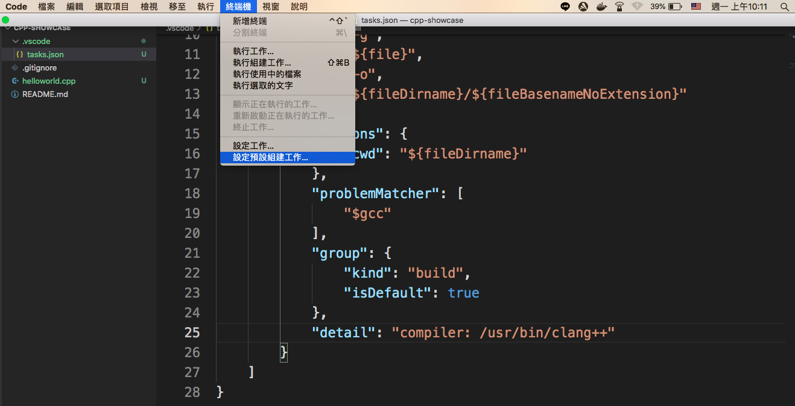
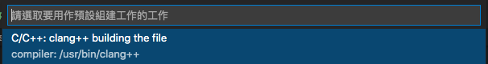

# cpp-showcase

## gcc vs make
* `gcc` is a C compiler
  * It compiles and/or links a single file
  * It does not knows how to combine several source files into a running program
* `make` is a build automation tool that invokes the compiler (which could be gcc) in a particular sequence to compile multiple sources and link them together
  * It automatically builds executable programs and libraries from source code by reading files called `Makefiles` which specify how to derive the target program
  * `make` is useful for controlling the build process of a project
  * It also tracks dependencies between various source files and object files that result from compilation of sources

## gcc vs g++
* `gcc` is for C
* `g++` is for Cpp

## make vs CMake
* make (or makefile) is a buildsystem 
  * it drives the compiler and other build tools to build your code

* CMake is a generator of buildsystems
  * It can produce Makefiles, it can produce Ninja build files, it can produce KDEvelop or Xcode projects, it can produce Visual Studio solutions from the same CMakeLists.txt file

## How to setup vscode in Mac
* Generate `tasks.json` in `.vscode` folder
* It is still calling clang++ for compiling
 

* select `clang++`
  

* build it
  

# Ref
[How to buld](https://code.visualstudio.com/docs/cpp/config-clang-mac)
[status of cpp](https://www.jetbrains.com/lp/devecosystem-2019/cpp/)
